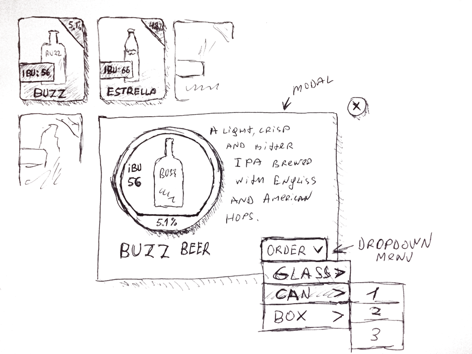

# Senior Front-End developer code challenge

Please create a user-friendly application that utilizes LESS and TypeScript. When the application loads, it should fetch data from https://api.jsonbin.io/v3/b/6630fd9be41b4d34e4ecd1f9 and display it as a grid of boxes. Each box should have a title, IBU, ABV, and picture of the item. The design should be similar to the attached image.

By clicking on an item, a modal window should appear with the item's description. Additionally, there should be a button inside the modal that, when clicked, displays a drop-down menu with two levels.

The background color of each cell should be `bg1`, `bg2`, etc., up to `bg9` based on the first digit of the IBU value. This feature should be themable using a LESS theme file.

The target device for this application is iPad Safari. Therefore, the application should be optimized for this platform. When the device is rotated, the grid of boxes should span the entire device. For example, when in portrait mode, the grid should be 4 boxes wide, and when in landscape mode, the grid should be 7 boxes wide.

Avoid usage of any frameworks, such as React, Angular, Vue, Tailwind, or Bootstrap.

